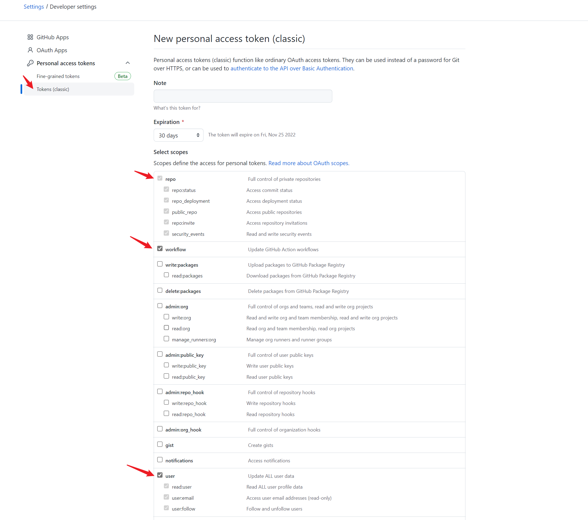
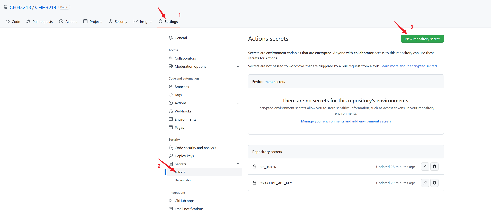
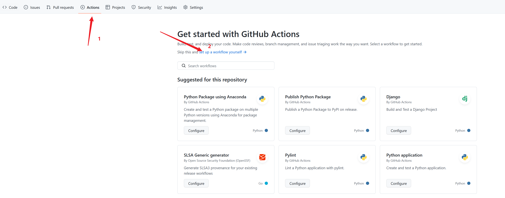
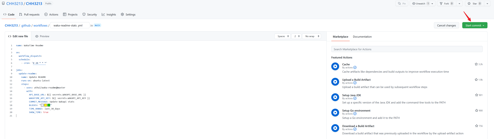
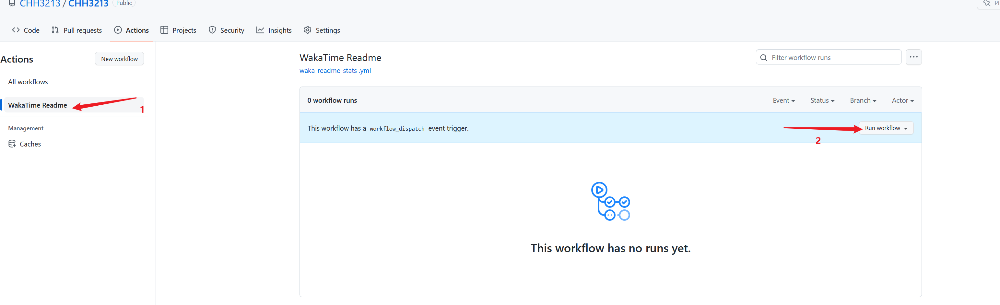
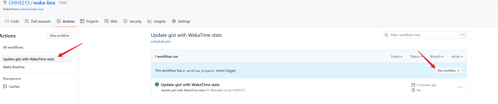
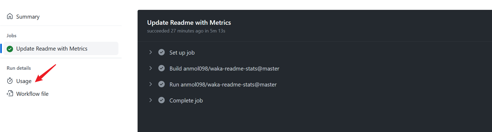

Github主页的展示效果总结。
<!--more-->
## 添加Github状态

实现效果如下：


配置地址见：https://github.com/anuraghazra/github-readme-stats


## 添加Github小图标

如何添加下图所示的小图标呢？


方法很简单：

1. 找到这个网站主页：https://shields.io/，这其实就是一个设计图标的网站。
2. 打开官网主页后，找到下述图中信息，直接填充好文字和信息，以及图标的颜色，点击`Make Badge`，就会生成这个图标的地址。

​	

3. 然后在Github主页插入即可。插入方式如下：

```bash
[](https://blog.csdn.net/weixin_42301220?spm=1010.2135.3001.5343)
```

前面的是图标地址，后面的是链接地址。	生成后的图标如下：

[](https://blog.csdn.net/weixin_42301220?spm=1010.2135.3001.5343)


## 使用Wakatime记录你的Coding数据


[WakaTime](https://wakatime.com/) 是一款可以记录你的编码时间的工具，目前支持绝大部分主流的 IDE 以及 Chrome 浏览器。


### 安装Wakatime

1. [注册](https://wakatime.com/signup) WakaTime 账号；
2. 在[官网](https://wakatime.com/plugins)找到对应的 IDE 插件，按照步骤安装 WakaTime 插件；
3. 在[个人设置](https://wakatime.com/settings/account)页面复制 Secret API Key ，填入对应的 WakaTime 插件中；
4. 过一段时间后，你就可以在 WakaTime 网站上看到你的编码情况；


### 主页接入waka-box

[waka-box](https://github.com/matchai/waka-box)提供了你每周的代码状态，并且更新为类似于下面的内容：


下面是接入步骤：

1. 获取 GitHub API 令牌， 打开 `Settings / Developer settings / Personal access tokens` 页面，创建 [`Github Token`](<https://github.com/settings/tokens/new>) ，权限部分勾选`repo`、`workflow`和`user`。生成后将`token`保存下来

      

2. 进入 `WakaTime` [配置页面](https://wakatime.com/settings/profile)，勾选 `Display coding activity publicly` 与 `Display languages, editors, operating systems publicly`
3. 查看 `WakaTime` 账号 [api-key](https://wakatime.com/settings/api-key)，并保存好

项目设置

1. 在你的Github 自定义首页的仓库，打开 `Settings / Secrets / Actions` 页面，点击 `New repository secret`
    
      

2. 添加 `Secret API Key` 密钥，Name 为 `WAKATIME_API_KEY` ，value 为`Secret API Key` 密钥
3. 添加 `Secret API Key` 密钥，Name 为 `GH_TOKEN` ，value 为`GitHub API` token
4. 配置Github Action工作流

    打开该仓库的 `Actions` 页面，点击 `set up a workflow yourself` 设置工作流
    
      
    
    文件名随意，清空初始内容，添入如下配置
    ```yaml
    name: Waka Readme

    on:
    schedule:
        # Runs at 12am IST
        - cron: '30 18 ** *'
    workflow_dispatch:
    jobs:
    update-readme:
        name: Update Readme with Metrics
        runs-on: ubuntu-latest
        steps:
        - uses: anmol098/waka-readme-stats@master
            with:
            WAKATIME_API_KEY: ${{ secrets.WAKATIME_API_KEY }}
            GH_TOKEN: ${{ secrets.GH_TOKEN }}
            SHOW_OS: "False"
            SHOW_PROJECTS: "False"
            SHOW_COMMIT: "False"
            SHOW_DAYS_OF_WEEK: "False"
            SHOW_TIMEZONE: "False"
            SHOW_EDITORS: "False"
            SHOW_SHORT_INFO: "False"
            SHOW_LOC_CHART: "False"
            SHOW_TOTAL_CODE_TIME: "False"
            SHOW_PROFILE_VIEWS: "False"
    ```
    
    一些自定义配置可以在 [waka-readme-stats](https://github.com/anmol098/waka-readme-stats) 仓库中找到示例。
    
      
    
    然后提交至仓库。

      

5. 更新`README.md`文件，在需要展示的地方，添加如下代码，下面代码相当于占位符，生成后的数据统计会放置在这个位置之中。

    ```yaml
    <!--START_SECTION:waka-->
    <!--END_SECTION:waka-->
    ```

6. 点击`update gist with WakaTime stats`，再点击`Run workflow`运行。
    
      
    
    > github actions 工作流是根据 .yml 配置文件定时运行任务，如果想马上看到结果，就需要手动执行一下
7. 运行成功后可以点击当前的workflow进入查看执行日志。

      
8. 以上配置完成后耐心等待数据同步到`readme`即可。


另外还可参考以下资料：

- [https://blog.csdn.net/weixin_43233914/article/details/126087735](https://blog.csdn.net/weixin_43233914/article/details/126087735)
- [https://github.com/athul/waka-readme#extras](https://github.com/athul/waka-readme#extras)
- [https://github.com/anmol098/waka-readme-stats](https://github.com/anmol098/waka-readme-stats)
