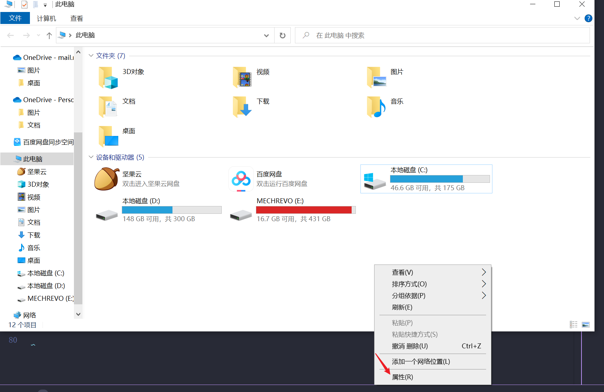

## 😋SakuraFrp简单介绍


[SakuraFrp](https://www.natfrp.com/user/)是一个内网穿透工具，使用它就可以轻松的实现在不是同一个局域网下的远程连接☺️。
内网穿透的基本原理可以戳[此处](https://doc.natfrp.com/#/basics)。

## 😋被控端电脑接入步骤

### 😉Sakura frp账号注册

首先在[官网](https://www.natfrp.com/user/)注册Sakura frp账号。注册完成后需要进行实名认证:

<!-- <center></center> -->


点击首页的这个地方可以查看访问密钥，这个密钥待会用得上，不能把访问密钥告诉给他人。

<!-- <center></center> -->


### 😉windows被控端设置

点击`穿透`下的`软件下载`按钮

<!-- <center></center> -->


进入页面后，官方推荐的是直接下载启动器，因此我们直接下载启动器即可。

<!-- <center></center> -->


下载完成后，点击安装即可。安装完后打开，软件大概长这样。

<!-- <center></center> -->


将刚才网页上的访问密钥填入，登录即可。

登陆完成后，点左边菜单栏的隧道，点击`+`号，进行相应的填写。例如这样

<!-- <center></center> -->


需要注意的是`隧道类型`和`穿透节点`的选择。`隧道类型`选择`TCP`（想使用`ssh`方式，也是选择`TCP`），`穿透结点`选择一个可以用的就行，本地IP填写`127.0.0.1`即可。填写完成后点击创建，隧道就创建成功了。

<!-- <center></center> -->


>隧道的创建也可以直接在网页上创建，然后在启动器中刷新即可。

最后，点击开启刚才的隧道，会弹出日志信息，记住这个日志信息上面的IP或者服务器域名，待会通过这个IP连接被控电脑：

<!-- <center></center> -->


至此，内网穿透全部搞定，被控电脑全部设置完毕。

### 😉远程连接被控端

上面创建内网穿透的过程其实就是分配了一个公网IP，所以接下来我们可以通过这个公网IP来访问我们的电脑；

win10提供了相当给力的远程连接工具：“远程桌面连接”。可以在windows系统之间进行远程控制。

如果没有启动远程桌面连接，那么按照下述步骤设置。

1. 打开`我的电脑`，右键点击`属性`

    <!-- <center></center> -->
    

2. 选择`远程设置`

    <!-- <center></center> -->
    

3. 点击`允许远程协助连接此计算机`即可开启。

    <!-- <center></center> -->
    

4. 开启之后，打开`远程桌面连接`程序，直接电脑的左下角菜单栏搜索即可出来。填入内网穿透的地址、远程计算机账户名、密码(无密码留空)即可远程。

    <!-- <center></center> -->
    


### 😉ubuntu被控端设置

ubuntu被控端需要下载`frpc`客户端，点击`穿透`下的`软件下载`按钮，进入后选择`linux系统`

<!-- <center></center> -->


至于选择哪一个架构，可以在ubutnu系统中在终端使用命令查看：

```
dpkg --print-architecture
```
或者使用
```
uname -m
```

<!-- <center></center> -->


详情可参考[博客](https://blog.csdn.net/weixin_41010198/article/details/109166131)查看Linux系统架构的命令。我的是`amd64`，因此选择`amd64`点击右边的`复制链接`。

在终端使用下面的命令进入 `/usr/local/bin` 目录并下载文件,确保现在已经处于有 `root` 权限的环境下。

```bash
cd /usr/local/bin

# 一般来说只需要使用这条命令:
wget -O frpc <下载地址>

# 如果上面的命令报错，请尝试这条:
curl -Lo frpc <下载地址>

# Linux frpc 通常已经过 UPX 压缩，如需下载未压缩的版本请在下载地址尾部加上 _noupx

```

<!-- <center></center> -->


然后设置权限并校验文件是否有损坏：

```bash
chmod 755 frpc
ls -ls frpc
md5sum frpc
```
<!-- <center></center> -->


此时 `frpc` 就安装完成并可以正常使用了。可以用此命令查看 `frpc` 版本号：
```bash
frpc -v
```

### 😉ubutnu 使用 frpc

通过上节安装完成后，在终端使用命令开启frpc，注意加root权限：
```bash
sudo frpc
```
在 Token 后面的文本框内输入访问密钥，然后使用 Tab 键切换到 Login 按钮并按 回车 键登录 (若终端支持也可使用鼠标进行操作)：


登录成功后 TUI 会显示当前账户下的隧道列表，使用方向键选中想要启动的隧道，按空格标为绿色 (或使用鼠标直接点击隧道)：


>可以一次性启用多个隧道，但是这些隧道必须位于同一节点下,也可以直接选中节点来启用该节点下的所有隧道

选择完毕后，即可启动隧道，相关启动参数会被保存到配置文件 frpc.ini 中，下次不带参数直接运行 frpc 时不再显示 TUI 而是直接启动隧道。


至此，ubuntu的被控端部分设置完毕，远程只需要填入得到的公网ip或者域名即可。
