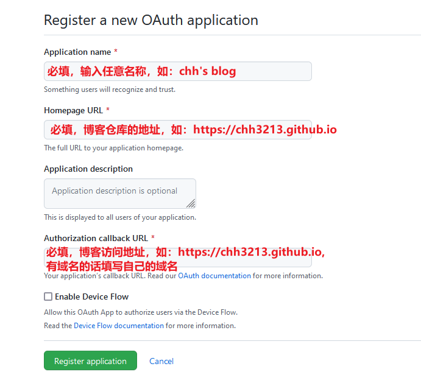
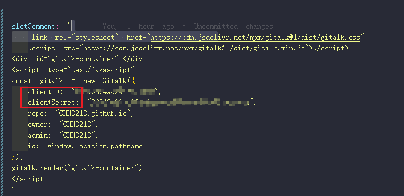
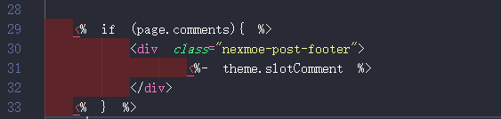
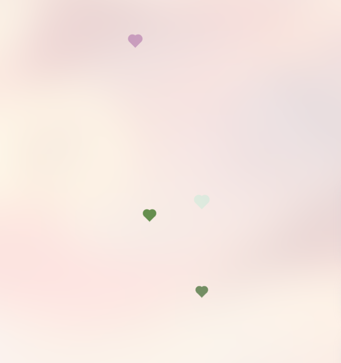
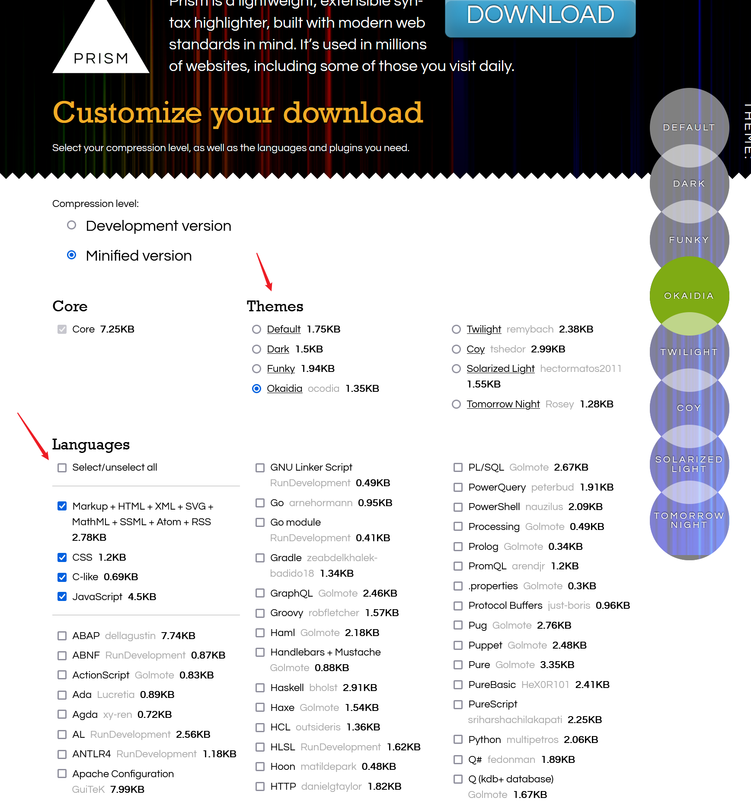
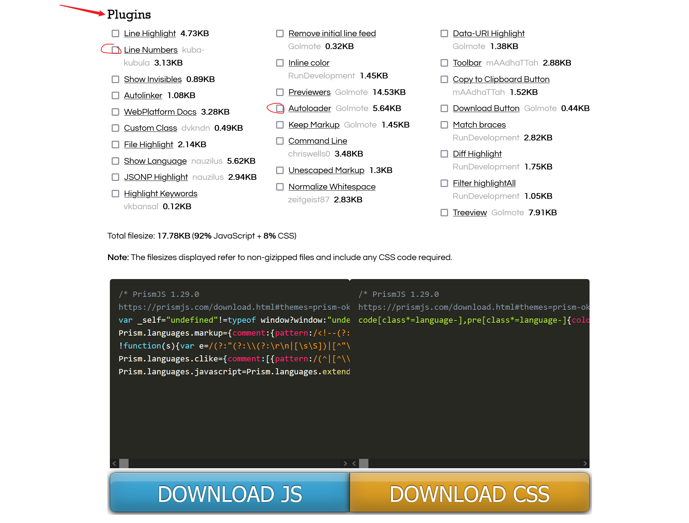
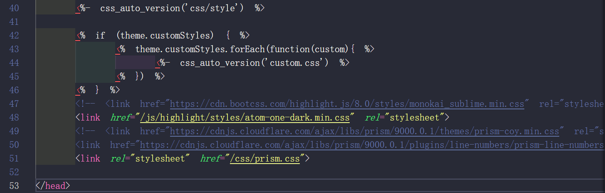
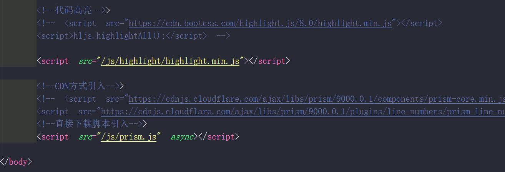
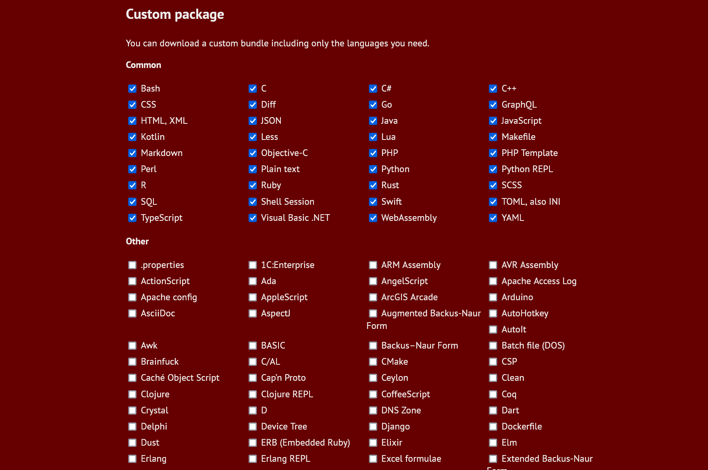
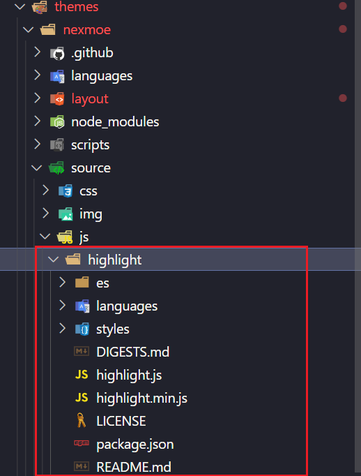

搭建的hexo博客的美化技巧。
<!--more-->

除了[主题自带的技巧](https://docs.nexmoe.com/v3.2/)外，这边再总结一些我用到的技巧。

## 文章封面生成随机图片

使用: 只要请求图片时, 将路径改为API提供的路径即可.

对于Markdown来说:

```

```

对于HTML来说是修改src属性:

```

```

但是仅仅这样做会出现一个问题:

当前页面使用同一个api链接的文章, 图片显示的都是同一张!(说好的随机呢?)

问题就出现在, 发起请求时, 由于链接地址是同一个, 实际上即使同一个页面中有多个(相同)图片链接, 也仅仅发起一次请求, 所以也就返回一张图片了!

所以只要修改链接不同即可!

以本博客使用到的api为例: http://api.mtyqx.cn/tapi/random.php

可以在末尾添加`?x`, 其中`x`是一个数字, 如: <http://api.mtyqx.cn/tapi/random.php?54615>

此时这是两个完全不同的请求, 所以显示的图片即为不同了!

### 附随机图片的一些API

- 二次元: https://img.paulzzh.tech/touhou/random
- 二次元: http://www.dmoe.cc/random.php
- 二次元：http://api.mtyqx.cn/tapi/random.php

## 添加动漫人物(看板娘)
Hexo博客本身支持看板娘的，三步即可。

第一步，在主目录下执行命令：

```bash
npm install --save hexo-helper-live2d
```
第二步，同样在主目录下执行：

```bash
npm install live2d-widget-model-shizuku
```

`live2d-widget-model-shizuku`是可选项。可选的模型如下：

```yaml
live2d-widget-model-chitose
live2d-widget-model-epsilon2_1
live2d-widget-model-gf
live2d-widget-model-haru
live2d-widget-model-haruto
live2d-widget-model-hibiki
live2d-widget-model-hijiki
live2d-widget-model-izumi
live2d-widget-model-koharu
live2d-widget-model-miku
live2d-widget-model-ni-j
live2d-widget-model-nico
live2d-widget-model-nietzsche
live2d-widget-model-nipsilon
live2d-widget-model-nito
live2d-widget-model-shizuku
live2d-widget-model-tororo
live2d-widget-model-tsumiki
live2d-widget-model-unitychan
live2d-widget-model-wanko
live2d-widget-model-z16
```

第三步，在根目录配置文件（_config.yml）中添加如下代码：

```yaml
live2d:
  enable: true
  scriptFrom: local
  pluginRootPath: live2dw/
  pluginJsPath: lib/
  pluginModelPath: assets/
  tagMode: false
  log: false
  model:
    use: live2d-widget-model-shizuku
  display:
    position: right
    width: 150
    height: 300
  mobile:
    show: true
  react:
    opacity: 0.7
```

然后重新部署即可。


hexo博客本身看板娘角色比较单调，stevenjoezhang大佬写了一个可以说话，可以换装的看板娘项目并开源，使用起来也是非常的方便。下面是Nexmoe主题下的安装步骤。

1. 下载大神的仓库[live2d-widget](https://github.com/stevenjoezhang/live2d-widget)到主目录`\themes\nexmoe\source`下，修改`live2d-widget`目录下的`autoload.js`文件中的路径

  ```c
  // 注意：live2d_path 参数应使用绝对路径
  //const live2d_path = "https://cdn.jsdelivr.net/gh/stevenjoezhang/live2d-widget@latest/";
  const live2d_path = "/live2d-widget/";
  ```

2. 往`\themes\nexmoe\layout\_partial\_post`目录下的`header.ejs`添加以下代码(在第一个`div`标签内):

  ```c
  // 注意：live2d_path 参数应使用绝对路径
  //const live2d_path = "https://cdn.jsdelivr.net/gh/stevenjoezhang/live2d-widget@latest/";
  const live2d_path = "/live2d-widget/";
  ```

3. 在根目录配置文件（_config.yml）中添加如下代码：
  ```yaml
  live2d: ##自定义看板娘动画
    enable: true
  ```

然后重新部署即可。想修改看板娘大小、位置、格式、文本内容等，可查看并修改 `waifu-tips.js` 、 `waifu-tips.json` 和 `waifu.css`。其实看板娘可以侧边隐藏，对样本的修改影响也不大。

## 添加评论

本篇博客使用的主题是`nexmoe`主题，它的配置评论的方式如下（gitalk为例）：

- 在[GitHub](https://github.com/settings/applications/new)上申请`OAuth application`
    

- 点击生成后，记住`Client ID`和 `Client Secret`
- 在`themes`文件夹下的`_config.nexmoe.yml`文件中，把刚才的`Client ID`和 `Client Secret`填在下面方框：
  ```xml
  slotComment: '
    <link rel="stylesheet" href="https://cdn.jsdelivr.net/npm/gitalk@1/dist/gitalk.css">
    <script src="https://cdn.jsdelivr.net/npm/gitalk@1/dist/gitalk.min.js"></script>
  <div id="gitalk-container"></div>
  <script type="text/javascript">
  const gitalk = new Gitalk({
    clientID: "",
    clientSecret: "",
    repo: "CHH3213.github.io",      
    owner: "CHH3213",
    admin: "CHH3213",
    id:  decodeURI(window.location.pathname)     
  });
  gitalk.render("gitalk-container")
  </script>
  '
  ```

  即下图所示：
    
  文章代码中出现过这两个链接
  ```xml
  <link rel="stylesheet" href="https://cdn.jsdelivr.net/npm/gitalk@1/dist/gitalk.css">
  <script src="https://cdn.jsdelivr.net/npm/gitalk@1/dist/gitalk.min.js">
  ```
  这两个链接指引的文件是配置gitalk的代码，可以下载后保存于自己的网站并修改文章中的链接，获得相同的效果。

- 然后配置完成后，在需要开启评论框的文章中，开启评论：`comments: true`即可。
- 最后，`hexo g -d`部署生成后登录评论框初始化即可。


> `nexmoe`主题的评论已经支持了任何评论系统，在`themes/nexmoe/layout/post.ejs`文件中可以看到，它是这么开启的
>   


## 添加页面点击出现爱心特效

- 在 `themes/你选择的主题/source/js` 下新建文件 `heart.js`文件 ，添加：
  ```js
  !(function (e, t, a) {
    function n() {
      c(
        ".heart{width: 10px;height: 10px;position: fixed;background: #f00;transform: rotate(45deg);-webkit-transform: rotate(45deg);-moz-transform: rotate(45deg);}.heart:after,.heart:before{content: '';width: inherit;height: inherit;background: inherit;border-radius: 50%;-webkit-border-radius: 500%;-moz-border-radius: 50%;position: fixed;}.heart:after{top: -5px;}.heart:before{left: -5px;}"
      ),
        o(),
        r();
    }
    function r() {
      for (var e = 0; e < d.length; e++)
        d[e].alpha <= 0
          ? (t.body.removeChild(d[e].el), d.splice(e, 1))
          : (d[e].y--,
            (d[e].scale += 0.004),
            (d[e].alpha -= 0.013),
            (d[e].el.style.cssText =
              "left:" +
              d[e].x +
              "px;top:" +
              d[e].y +
              "px;opacity:" +
              d[e].alpha +
              ";transform:scale(" +
              d[e].scale +
              "," +
              d[e].scale +
              ") rotate(45deg);background:" +
              d[e].color +
              ";z-index:99999"));
      requestAnimationFrame(r);
    }
    function o() {
      var t = "function" == typeof e.onclick && e.onclick;
      e.onclick = function (e) {
        t && t(), i(e);
      };
    }
    function i(e) {
      var a = t.createElement("div");
      (a.className = "heart"),
        d.push({
          el: a,
          x: e.clientX - 5,
          y: e.clientY - 5,
          scale: 1,
          alpha: 1,
          color: s(),
        }),
        t.body.appendChild(a);
    }
    function c(e) {
      var a = t.createElement("style");
      a.type = "text/css";
      try {
        a.appendChild(t.createTextNode(e));
      } catch (t) {
        a.styleSheet.cssText = e;
      }
      t.getElementsByTagName("head")[0].appendChild(a);
    }
    function s() {
      return (
        "rgb(" +
        ~~(255 * Math.random()) +
        "," +
        ~~(255 * Math.random()) +
        "," +
        ~~(255 * Math.random()) +
        ")"
      );
    }
    var d = [];
    (e.requestAnimationFrame = (function () {
      return (
        e.requestAnimationFrame ||
        e.webkitRequestAnimationFrame ||
        e.mozRequestAnimationFrame ||
        e.oRequestAnimationFrame ||
        e.msRequestAnimationFrame ||
        function (e) {
          setTimeout(e, 1e3 / 60);
        }
      );
    })()),
      n();
  })(window, document);
  ```

- 在`themes/你选择的主题/layout/layout.ejs`文件的`body`标签内添加：
  ```xml
  <!-- 页面点击小红心-- 20221025-->
  <script type="text/javascript" src="/js/heart.js"></script>
  ```

- 重新部署生成后，即可出现特效。
  ```bash
  hexo clean & hexo generate & hexo server
  ```
  <!--    -->


## 浏览器网页标题特效

- 当用户访问你的博客时点击到了其他网页，我们可以让网页标题产生特效，呼唤用户回来，首先在目录 `themes/你选择的主题/source/js`  下新建一个 `funnyTitle.js` 文件，在里面填写如下代码：

  ```js
  <!--浏览器搞笑标题-->
  var OriginTitle = document.title;
  var titleTime;
  document.addEventListener('visibilitychange', function () {
      if (document.hidden) {
          $('[rel="icon"]').attr('href', "/img/trhx2.png");
          document.title = 'ヽ(●-`Д´-)ノ我在这等你！';
          clearTimeout(titleTime);
      }
      else {
          $('[rel="icon"]').attr('href', "/img/trhx2.png");
          document.title = 'ヾ(Ő∀Ő3)ノ谢谢你回来！' + OriginTitle;
          titleTime = setTimeout(function () {
              document.title = OriginTitle;
          }, 2000);
      }
  });
  ```
- 在`themes/你选择的主题/layout/layout.ejs`文件的`body`标签内添加：
  
  ```xml
  <!--搞笑title-->>
  <script type="text/javascript" src="/js/funnyTitle.js"></script>
  ```
- 重新部署即可。


## 添加代码块复制功能

博客主题本身并没有集成代码块复制功能，因此这里给主题添加这个功能。
> 此方法对所有没有代码块复制功能的主题都有效，基于 [https://github.com/zenorocha/clipboard.js](https://github.com/zenorocha/clipboard.js) 实现.


- 下载[js文件](https://raw.githubusercontent.com/zenorocha/clipboard.js/master/dist/clipboard.min.js)保存到`themes/你的主题/source/js`下。

- 在`themes/你的主题/source/js`目录下，创建`clipboard-use.js`，文件，添加内容如下：
  
  ```js
  $(".highlight").wrap("<div class='code-wrapper' style='position:relative'></div>");
  /*页面载入完成后，创建复制按钮*/
  !function (e, t, a) {
      /* code */
      var initCopyCode = function () {
          var copyHtml = '';
          copyHtml += '<button class="btn-copy" data-clipboard-snippet="">';
          copyHtml += '  <i class="fa fa-clipboard"></i><span>复制</span>';
          copyHtml += '</button>';
          $(".highlight .code").before(copyHtml);
          var clipboard = new ClipboardJS('.btn-copy', {
              target: function (trigger) {
                  return trigger.nextElementSibling;
              }
          });
          clipboard.on('success', function (e) {
              e.trigger.innerHTML = "<i class='fa fa-clipboard'></i><span>复制成功</span>"
              setTimeout(function () {
                  e.trigger.innerHTML = "<i class='fa fa-clipboard'></i><span>复制</span>"
              }, 1000)
            
              e.clearSelection();
          });
          clipboard.on('error', function (e) {
              e.trigger.innerHTML = "<i class='fa fa-clipboard'></i><span>复制失败</span>"
              setTimeout(function () {
                  e.trigger.innerHTML = "<i class='fa fa-clipboard'></i><span>复制</span>"
              }, 1000)
              e.clearSelection();
          });
      }
      initCopyCode();
  }(window, document);
  ```
- 在`themes/你的主题/source/css/style.css`或者`themes/你的主题/source/css/style.styl` 样式（有的主题是`css格式`，有的是`styl格式`，差别并不大。）中添加如下代码：
  
  ```css
  //代码块复制按钮
  .highlight{
    //方便copy代码按钮（btn-copy）的定位
    position: relative;
  }
  .btn-copy {
      display: inline-block;
      cursor: pointer;
      background-color: #eee;
      background-image: linear-gradient(#fcfcfc,#eee);
      border: 1px solid #d5d5d5;
      border-radius: 3px;
      -webkit-user-select: none;
      -moz-user-select: none;
      -ms-user-select: none;
      user-select: none;
      -webkit-appearance: none;
      font-size: 13px;
      font-weight: 700;
      line-height: 20px;
      color: #333;
      -webkit-transition: opacity .3s ease-in-out;
      -o-transition: opacity .3s ease-in-out;
      transition: opacity .3s ease-in-out;
      padding: 2px 6px;
      position: absolute;
      right: 5px;
      top: 5px;
      opacity: 0;
  }
  .btn-copy span {
      margin-left: 5px;
  }
  .highlight:hover .btn-copy{
    opacity: 1;
    z-index: 100 //这个是让按钮处于最顶层，数值越大，层级越上
  }
  ```

- 引用js文件，将以下代码加入到你的`layout布局文件`（例如，nexmoe主题是在`themes/你的主题/layout/layout.ejs`文件）的`body标签`内：
  ```xml
  <!-- 代码块复制功能,注意src路径 -->
  <script type="text/javascript" src="/js/clipboard.min.js"></script>  
  <script type="text/javascript" src="/js/clipboard-use.js"></script>
  ```

> 当然将 `clipboard.js` 和 `clipboard-use.js` 保存到CDN上，通过远程引用也可以.
> 
> 目前存在的bug：如果代码块部分内容超出有横向滑动,复制按钮copy就会跟着移动,而不能固定在右上角

## 代码块高亮

在`nexmoe`主题中，使用hexo原生的`hightlight`并没有起作用，根据[官网教程](<https://hexo.io/zh-cn/docs/syntax-highlight#Highlight-js>)，这里给出两种方法进行代码块的高亮。

### 使用prismjs进行代码高亮

Prism是一种轻量级的，可扩展的语法突出显示工具，在构建时考虑了现代Web标准。

- 进入[prismjs官网](https://prismjs.com/download.html)，依据情况选择主题、语言和最下方的插件。

    

    

  其中语言我全部勾选了，插件如图所示选择了两个。选择完成后点击下方的下载按钮，分别下载css和js文件。下载后的文件可以保存在`themes/你的主题/source/js`文件夹下。

- 下载完成后，引入css文件和js文件即可。打开`themes/你的主题/layout/layout.ejs`文件（部分主题可能是swig格式），在`head`标签内添加`css`文件链接：

  ```xml
  <link rel="stylesheet" href="/css/prism.css">
  ```

  其中`href`后面填写的就是你下载的css文件的路径。假如你放在了`themes/你的主题/source/js`文件夹下，那么引入方式为：

  ```xml
  <link rel="stylesheet" href="/js/prism.css">
  ```

  即下图：

    


- js文件的引入类似，也是在这个文件中，但是此时是在`body`标签内引入。

  ```xml
  <script src="/js/prism.js" async></script>
  ```

  即下图：

    


  同理，`src`是你的路径。

- 在完成上述步骤后，在博客的配置文件`_config.yml`中配置：

  ```yaml
  highlight:
    enable: false
  prismjs:
    enable: true
    preprocess: true
    line_number: true
    line_threshold: 0
    tab_replace: ''
  ```

- 最后重新编译即可。


### 使用hightlight.js进行代码高亮

使用hightlight.js配置的方式与prismjs类似。

- 首先前往[hightlight.js下载页面](https://highlightjs.org/download/)，勾选常用语言后，下拉点击`Download`按钮

    


- 将下载后的文件解压在`themes/你的主题/source/js`文件夹下。

    


- 打开`themes/你的主题/layout/layout.ejs`文件，在`body`标签内引入：

  ```xml
  <script src="/js/highlight/highlight.min.js"></script>
  ```

  即下图：

    

  注意`src`是你存放的路径。

- 然后，打开`hightlight/styles/`文件夹，里面有很多`css`主题样式，选择一个你想要的主题，例如，我选择的是`atom-one-dark.min.css`样式，那么就在`layout.ejs`文件下的`head`标签内引入：

  ```xml
  <link href="/js/highlight/styles/atom-one-dark.min.css" rel="stylesheet">
  ```

  即下图：

    

- 最后，在博客配置文件`_config.yml`中配置：

  ```yaml
  highlight:
    enable: true
    line_number: true
    auto_detect: true
    tab_replace: ''
    wrap: true
    hljs: true
  ```

- 编译部署后即可生效。